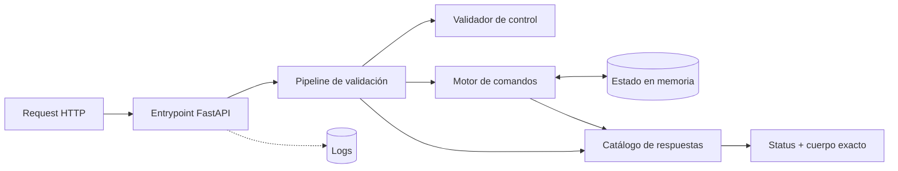

# Arquitectura — La caja negra

Los componentes se describen en `doc-diseno.md` §3.

## Clon (en Railway)

```mermaid
flowchart LR
    IN[Request HTTP] --> EP[Entrypoint FastAPI]
    EP --> PIPE[Pipeline de validación]
    PIPE --> CTL[Validador de control]
    PIPE --> MOT[Motor de comandos]
    MOT <--> EST[(Estado en memoria)]
    PIPE --> CAT[Catálogo de respuestas]
    MOT --> CAT
    CAT --> OUT[Status + cuerpo exacto]
    EP -.-> LOG[(Logs)]
```
